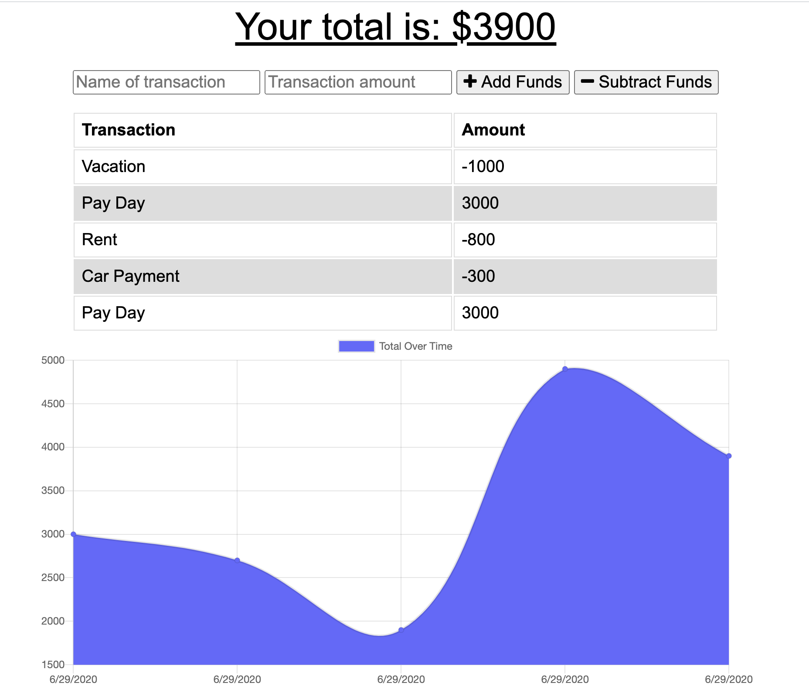

# Budget-Tracker

## Description

This app allows users to add expenses and deposits to their budget with or without a connection. When entering transactions offline, they should populate the total when brought back online.

Offline Functionality:

  * Enter deposits offline

  * Enter expenses offline

When brought back online:

  * Offline entries should be added to tracker.

## User Story
AS AN avid traveller
I WANT to be able to track my withdrawals and deposits with or without a data/internet connection
SO THAT my account balance is accurate when I am traveling

 ## Table of Contents:
  * [Installation](#installation)
  * [Usage](#usage)
  * [License](#license)
 
  
  ## Installation 
  To use, install the following package: npm install

  ## Usage
  View the deployed app at https://young-retreat-87784.herokuapp.com/
  To run locallly, use the following command: node server.js

  ## License

   

  This was created by CateDunn. Check out the project at https://github.com/CateDunn/Budget-Tracker. You can contact me at catedunn@alumni.unc.edu.
